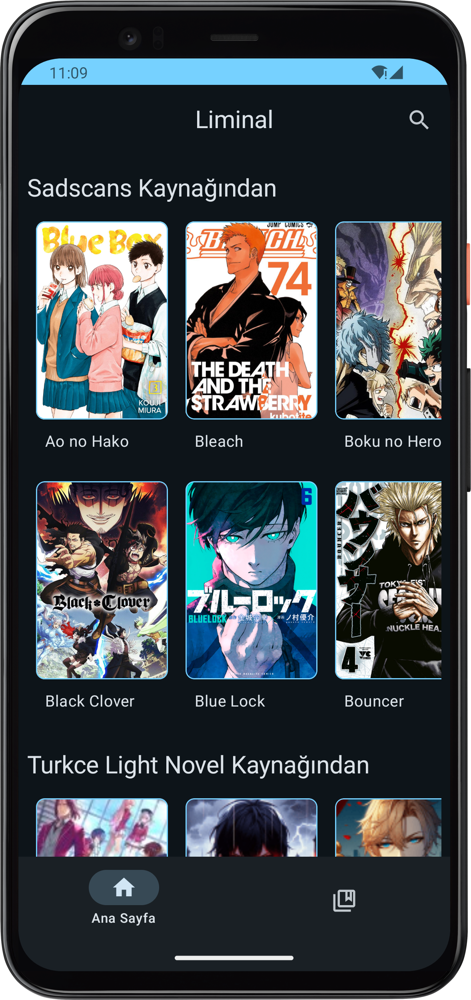
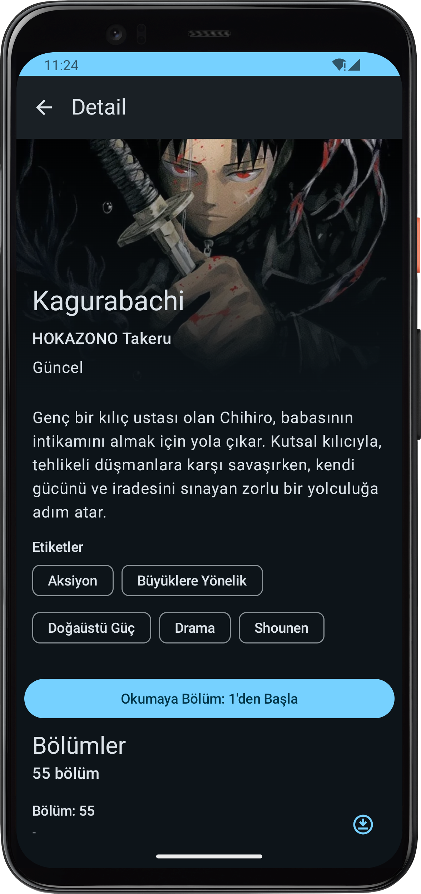
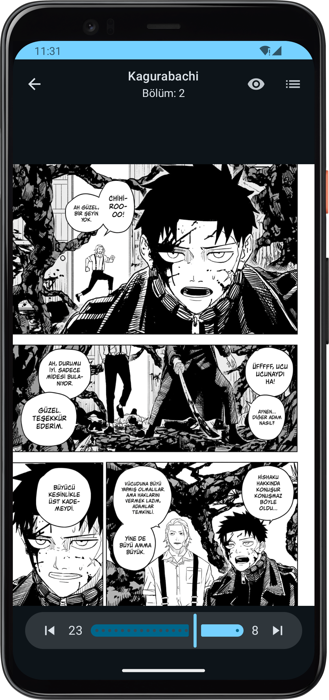
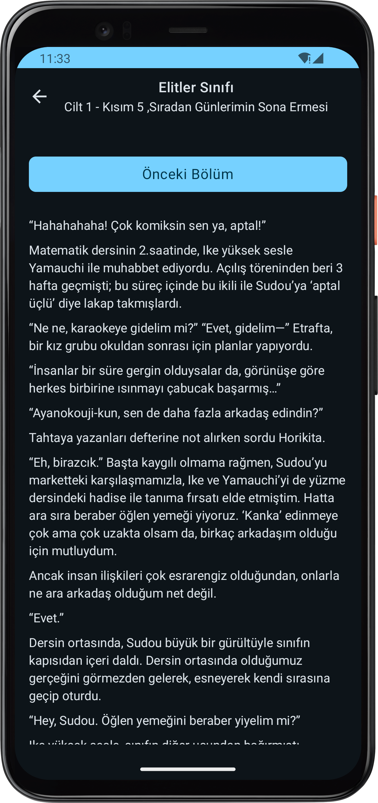
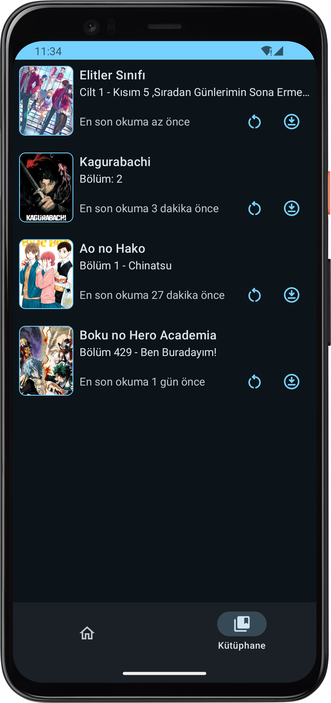

[Banner](images/Liminal-Banner.png)
# Liminal

**Liminal** is a simple Manga and Novel Reader Android application built using **Kotlin** and **Jetpack Compose**. The app fetches manga and novel data from Turkish websites using **web scraping**. Users can save their reading progress and download series for offline reading.

## Screenshots

| Home Screen           | Detail Screen        |
|------------------------|----------------------|
|  |  |

| Manga Reading Screen  | Novel Reading Screen | Library Screen |
|------------------------|----------------------|----------------|
|  |  |  |

## Features

- Read manga and novels from Turkish sources.
- Save reading progress.
- Download series for offline access.

## Technologies Used

- Kotlin
- Jetpack Compose
- Room
- Hilt
- WorkManager
- Jsoup
- Material Design 3
- Coroutines and Flow

## How to Build and Run

1. Clone the repository:

    ```bash
    git clone https://github.com/Neccar43/Liminal.git
    cd liminal
    
    ```

2. Open the project in Android Studio.
3. Build and run the app.

## Contributing

If you'd like to contribute, you can fork the project and submit a pull request.

## Future Plans

- Improve the downloading process.
- Add support for the MangaDex API.